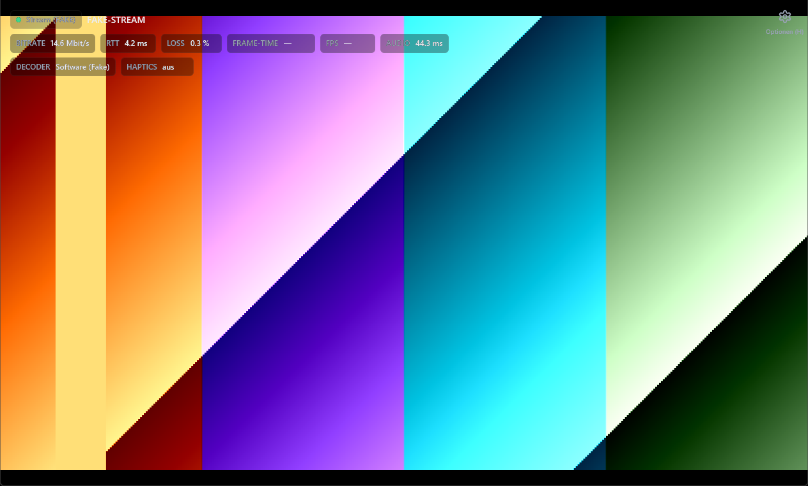

# chiaki-rust

A complete from-scratch Rust port of the [chiaki-ng](https://github.com/streetpea/chiaki-ng) PS5/PS4 remote-play client for **Windows x64**, with a native GPU UI, a fully GPU-resident video path, NVIDIA VSR upscaling, and an OBS virtual camera feed with a headless mode.



> Tested live against a real PS5 (1080p60 H.265): RTT ~1 ms, 0% loss, stable 60 fps through the GPU path with VSR 2x active, 0 decode errors.

## Why this fork of reality exists

This is a 1:1 port: the C++ code is treated as the spec — protocol state machines, constants, timeouts and byte formats are carried over exactly, while memory management is idiomatic safe Rust (`#![deny(unsafe_code)]` in the protocol crates; FFI confined to the media/render/input layers). Settings INI files are **byte-compatible with the C++ client** (Qt QSettings format), so existing users can switch binaries without re-registering.

Everything runs: discovery, registration wizard, LAN streaming (H.264/H.265, 720p–1080p @30/60), PSN remote play over the internet (holepunch/RUDP/UPnP/STUN), DualSense with rumble/adaptive triggers/haptics, microphone, sleep/wake, PIN login, PSN OAuth — plus the two features below that go beyond the C++ client.

## NVIDIA VSR (RTX Video Super Resolution)

The video path keeps frames GPU-resident end to end: NVDEC CUDA decode → VSR inference → CUDA↔D3D11 interop → swapchain present, with a transparent GPUI overlay window for HUD and dialogs. No per-frame CPU round-trip. The measured media pipeline cost is ~2.2 ms/frame at 1080p→4K VSR 2x on an RTX 4090 (budget: 16.7 ms).

VSR upscales the stream to up to 4K in real time (auto-targeting the display resolution, like browser VSR). The active upscale factor is shown as a badge in the stream, and per-frame stats (bitrate, RTT, loss, frame time, jitter) live in the HUD.

**Setup**

1. You need a GeForce RTX GPU (VSR is RTX-only) with current drivers.
2. Download the **NVIDIA Video Effects SDK** from NVIDIA and unpack it somewhere.
3. Point the client at it — any of these works (checked in this order):
   - `Settings → Video → VFX SDK path` (folder containing `NVVideoEffects.dll`)
   - the `CHIAKI_VSR_SDK_DIR` environment variable
   - `vfx_sdk/sdk/VideoFX/bin` next to (or one level above) `chiaki.exe` — the portable-zip layout
   - `C:\Program Files\NVIDIA Corporation\VFXSDK\VideoFX\bin`

`Settings → Video` shows a live status line (driver found / SDK found / ready), and every session re-checks availability before starting: if the driver or the SDK is missing, the client logs the reason, shows a toast, and **streams without upscaling instead of failing** — VSR never takes the video down with it. Without VSR, decode runs on D3D11VA (or CUDA/Vulkan/software, selectable) on the same GPU-resident path.

## Virtual camera — stream into Discord/OBS as a webcam

The stream content is fed into the **OBS Virtual Camera**, so Discord, OBS, or any DirectShow consumer can bind it as a webcam — with VSR active, the camera receives the **full VSR-upscaled output** (e.g. 1080p stream → 4K camera), so viewers get the sharp picture.

- Enable it under `Settings → Video → Virtuelle Kamera` (camera resolution selectable without VSR).
- Requires OBS Studio to be installed once (its DirectShow filter is what apps see); OBS itself does **not** need to run — but must not start its own Virtual Camera at the same time (one writer).
- Restart Discord after the first session so it lists the camera.

**Headless mode:** `chiaki.exe --virtualcam [host|IP]` runs the whole feed without any window — session, decode, VSR, camera, plus audio playback on the local PC (you hear the game; the windowless process feeds Discord/OBS). From the GUI you can start/stop this detached feed (`Settings → Video` shows its status; with the camera setting enabled, clicking a console tile offers *normal stream* vs. *headless start/stop*), and an autostart toggle registers it for the next Windows login. Only one instance runs at a time (instance mutex + named stop event, robust even after a hard kill).

## Architecture

| Crate | Contents |
|---|---|
| `chiaki-core` | Complete protocol: takion, ctrl (TCP + RUDP), session/streamconnection state machines, regist, discovery, senkusha, FEC (byte-identical jerasure port), crypto (rpcrypt/gkcrypt/ECDH), protobuf, golden-value tests |
| `chiaki-remote` | holepunch (6065 LOC C, 1:1), rudp, stun, PSN auth/token refresh |
| `chiaki-media` | FFmpeg loaded dynamically (NVDEC-CUDA/D3D11VA/Vulkan + software), NVIDIA VSR FFI, Opus, WASAPI audio in/out, D3D11 staging downloads |
| `chiaki-render` | D3D11 video sink + NV12/RGBA shaders, CUDA↔D3D11 interop, CPU presenter fallback |
| `chiaki-input` | gilrs (XInput), native DualSense/DS4 via hidapi (rumble/triggers/haptics/LED), ViGEm virtual pads, keyboard mapping |
| `chiaki-settings` | Qt-QSettings byte-compatible INI, hosts/PSN/profiles |
| `chiaki-virtualcam` | OBS Virtual Camera feed (NV12, stride destriping, downscale), headless IPC (instance mutex, stop event, PID file) |
| `chiaki-steam` | Steam library shortcuts (VDF, grid art, controller layout) |
| `chiaki-ui` | GPUI app: home, consoles, registration wizard, settings (8 categories, ~190 rows, live search), stream view with HUD, PSN login |
| `chiaki-app` / `chiaki-cli` | The `chiaki.exe` binary (incl. headless virtualcam mode) and a headless test CLI (`discover`/`regist`/`stream`/`wake`) |

**Video path (GPU, default):** takion recv → frame processor (FEC) → media thread: NVDEC CUDA decode (raw device frames) → VSR (`process_frame_gpu`) → CUDA→D3D11 interop write into the sink texture → passthrough shader + letterbox → present. Without VSR: D3D11VA decode → GPU-internal copy. CPU fallback path available; frame pacing and vsync are optional per setting.

## Building

Windows x64 only. Toolchain is pinned in `rust-toolchain.toml`.

```
cargo build --release
cargo test --workspace
```

The app loads FFmpeg (avutil-59, avcodec-61, swscale-8, swresample-5), `libopus-0.dll` and — for VSR — the NVIDIA Video Effects SDK DLLs at runtime; place them next to `chiaki.exe` (any FFmpeg 7.1 win64 shared build works). `scripts/build-portable-zip.ps1 -SmokeTest` assembles a fully self-contained portable zip (SDK not included for license reasons — point the setting at your own unpack).

Tips:

- `CHIAKI_UI_FAKE_STREAM=1 ./target/release/chiaki.exe` renders a synthetic test stream — full UI/HUD/camera pipeline without a console.
- `cargo run -p chiaki-cli -- discover --timeout-ms 1500 --broadcast-addr <subnet>.255` (multi-NIC hosts need the interface-targeted broadcast).
- Logs land in `data/log/chiaki-ui.log` next to the exe.

## Status

Feature parity with the C++ client is complete for the Windows desktop flow (see the architecture table above; libplacebo rendering and Speex mic processing are the deliberate exceptions, replaced by the GPU shader path and omitting an optional build flag). What you will not find here is Android/Linux/console ports — Windows only, by design.

## License

AGPL-3.0-only, see [LICENSE](LICENSE) — same as chiaki-ng upstream. This project is a port of and owes everything to [chiaki-ng](https://github.com/streetpea/chiaki-ng) and the original [chiaki](https://github.com/thestr4ng3r/chiaki); upstream's protocol documentation and code made it possible.

**Disclaimer:** This project is not affiliated with Sony Interactive Entertainment. PlayStation, PS4 and PS5 are trademarks of Sony Interactive Entertainment Inc. You must own a console and a legitimate account; this client does not bypass any authentication.
